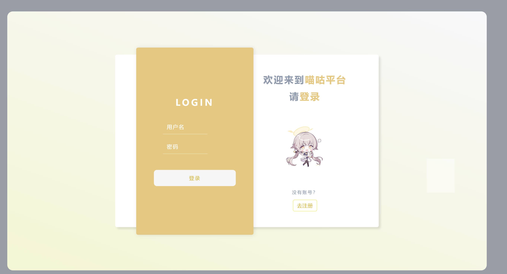
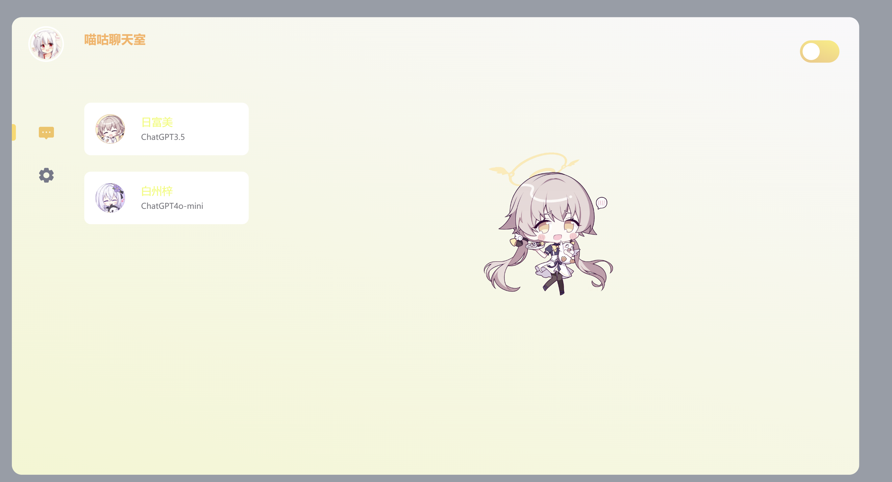
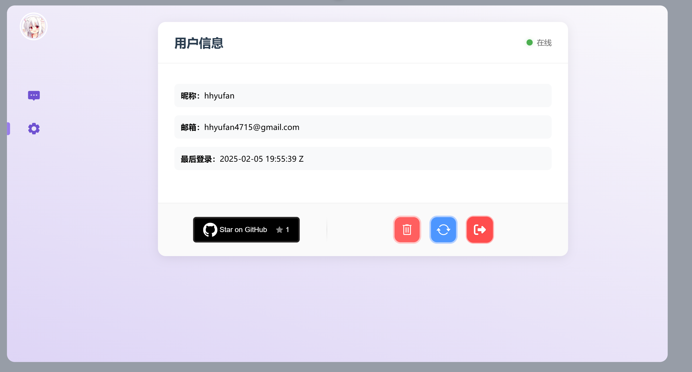
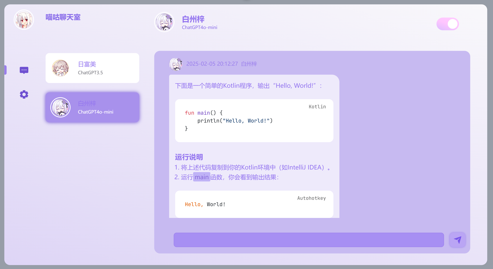

# 喵咕聊天平台前端

  

欢迎来到**喵咕聊天平台**前端工程的文档！本平台是一款融合ACG美学风格的智能AI对话系统，采用现代Web技术栈构建。
## 功能体验：
你可以使用`PC端`浏览器直接访问我的[喵咕聊天平台](https://www.miaogu.top)来体验AI平台功能！（token有限，请节约使用！）
## 📜 项目概览

### 核心实现
- **智能交互**：支持多模型对话（GPT3/4o-mini/DeepSeek v3）
- **个性主题**：双主题色系动态切换
- **安全认证**：JWT令牌认证体系
- **状态管理**：Vuex全局状态控制
- **Markdown**：marked.js进行md转html渲染，highlight.js提供代码高亮支持


## 🛠️ 技术选型

| 类别          | 技术栈                                                                 |
|---------------|----------------------------------------------------------------------|
| 核心框架      | Vue 3.3 + Composition API + JavaScript                              |
| 构建工具      | Vite 4.4                                                            |
| 状态管理      | Vuex 4.0                                                            |
| HTTP客户端    | Axios 1.5                                                           |
| 样式预处理器  | SCSS                                                                |
| UI组件库      | Element Plus                                                        |
| 代码规范      | ESLint                                                               |

## 🚀 快速开始

### 环境要求
- Node.js ≥16.0
- npm ≥8.0

### 本地部署
```bash
# 克隆仓库
git clone https://github.com/hhyufan/miaogu_aichat_frontend.git

# 进入项目目录
cd miaogu_aichat_frontend

# 安装依赖
npm install

# 启动开发服务器
npm run dev
```

访问 `http://localhost:5173` 即可体验平台功能

## 🌈 功能演示
### 登录注册UI
| 登录主题                         | 注册主题                           |
|-------------------------------------|--------------------------------|
|  |  |

### 主题切换系统
| 橙白活力主题                         | 紫白梦幻主题                         |
|--------------------------------------|--------------------------------------|
|  |  |

### 个人信息系统
| 个人信息系统                         |
|--------------------------------------|
|  |


### Markdown渲染
| Markdown渲染                         |
|--------------------------------------|
|  |

### 用户认证流程
```sequence
用户->前端: 提交凭证
前端->后端: POST /user/login
后端-->前端: JWT令牌
前端->浏览器: 存储Token
浏览器->前端: 每次请求携带Token
```

## 📡 API接口规范

感谢你的耐心！根据提供的 API 代码，以下是完整的 API 描述文档，包括所有相关的端点及其详细信息：

### API 描述文档

| 端点                   | 方法   | 描述                         |
|------------------------|--------|------------------------------|
| `/user/login`          | POST   | 用户登录                     |
| `/user/register`       | POST   | 用户注册                     |
| `/user/logout`         | POST   | 用户登出                     |
| `/user/refresh`        | POST   | 令牌刷新                     |
| `/user/token`          | POST   | 更新访问令牌                 |
| `/friend/friendList`   | POST   | 获取好友列表                 |
| `/{Type}/send`         | POST   | 发送聊天消息                 |
| `/{Type}/messages`     | POST   | 获取聊天信息                 |
| `/chat/clear`          | DELETE | 清除聊天记录                 |
| `/chat/revert`         | POST   | 回滚聊天消息                 |
| `/github/stars`        | POST   | 获取 GitHub 仓库的星标数量   |

### 端点详细信息

#### 1. `/user/login`
- **方法**: `POST`
- **描述**: 用户通过提供用户名和密码进行登录，成功后返回 JWT 令牌和用户信息。
- **请求参数**:
  ```json
  {
      "username": "string",
      "password": "string"
  }
  ```
- **响应示例**:
  ```json
  {
      "code": 200,
      "message": "登录成功",
      "data": {
          "token": "jwt_token_string",
          "refreshToken": "refresh_token_string",
          "expiresIn": 3600
      }
  }
  ```

#### 2. `/user/register`
- **方法**: `POST`
- **描述**: 用户注册新账户，提供用户名、密码和邮箱信息。注册成功后，返回 JWT 令牌和用户信息。
- **请求参数**:
  ```json
  {
      "username": "string",
      "password": "string",
      "email": "string"
  }
  ```
- **响应示例**:
  ```json
  {
      "code": 200,
      "message": "注册成功",
      "data": {
          "token": "jwt_token_string",
          "refreshToken": "refresh_token_string",
          "expiresIn": 3600
      }
  }
  ```

#### 3. `/user/logout`
- **方法**: `POST`
- **描述**: 用户登出，清除当前会话的令牌。
- **请求示例**: 无请求体
- **响应示例**:
  ```json
  {
      "code": 200,
      "message": "登出成功"
  }
  ```

#### 4. `/user/refresh`
- **方法**: `POST`
- **描述**: 使用刷新令牌获取新的访问令牌。需要提供当前用户名和刷新令牌。
- **请求参数**:
  ```json
  {
      "username": "string",
      "refreshToken": "string"
  }
  ```
- **响应示例**:
  ```json
  {
      "code": 200,
      "message": "刷新成功",
      "data": {
          "token": "new_jwt_token_string",
          "expiresIn": 3600
      }
  }
  ```

#### 5. `/user/token`
- **方法**: `POST`
- **描述**: 更新当前用户的访问令牌。
- **请求示例**: 无请求体
- **响应示例**:
  ```json
  {
      "code": 200,
      "message": "令牌更新成功",
      "data": {
          "token": "new_token_string"
      }
  }
  ```

#### 6. `/friend/friendList`
- **方法**: `POST`
- **描述**: 获取当前用户的好友列表。
- **请求示例**: 无请求体
- **响应示例**:
  ```json
  {
      "code": 200,
      "msg": "获取好友列表成功",
      "data": [
          {
              "id": "string",
              "name": "string"
          },
          ...
      ]
  }
  ```

#### 7. `/{Type}/send`
- **方法**: `POST`
- **描述**: 发送聊天消息。
- **请求参数**:
  ```json
  {
      "msg": "string",
      "recipientId": "string"
  }
  ```
- **响应示例**:
  ```json
  {
      "code": 200,
      "msg": "消息发送成功"
  }
  ```

#### 8. `/{Type}/messages`
- **方法**: `POST`
- **描述**: 获取指定类型的聊天信息。
- **请求示例**: 无请求体
- **响应示例**:
  ```json
  {
      "code": 200,
      "msg": "获取聊天记录成功",
      "data": [
          {
              "id": "string",
              "message": "string",
              "timestamp": "string"
          },
          ...
      ]
  }
  ```

#### 9. `/chat/clear`
- **方法**: `DELETE`
- **描述**: 清除聊天记录。
- **请求示例**: 无请求体
- **响应示例**:
  ```json
  {
      "code": 200,
      "msg": "聊天记录清除成功"
  }
  ```

#### 10. `/chat/revert`
- **方法**: `POST`
- **描述**: 回滚聊天消息。
- **请求参数**:
  ```json
  {
      "messageId": "string"
  }
  ```
- **响应示例**:
  ```json
  {
      "code": 200,
      "msg": "消息回滚成功"
  }
  ```

#### 11. `/github/stars`
- **方法**: `POST`
- **描述**: 获取 GitHub 仓库的星标数量。
- **请求参数**:
  ```json
  {
      "repo": "string"
  }
  ```
- **响应示例**:
  ```json
  {
      "code": 200,
      "msg": "获取星标数量成功",
      "data": 42   // 示例星标数量
  }
  ```

## 🧩 项目结构

```
miaogu_aichat/
├── src/
│   ├── api/            # 接口服务层
│   ├── assets/         # 静态资源
│   ├── components/     # 通用组件
│   ├── router/         # 路由配置
│   ├── store/          # Vuex状态管理
│   ├── utils/          # 工具函数
│   └── views/          # 页面组件
├── vite.config.js      # Vite配置
└── package.json        # 依赖管理
```

## 🤝 贡献指南

我们欢迎各种形式的贡献，请遵循以下流程：
1. Fork项目仓库
2. 创建特性分支 (`git checkout -b feature/AmazingFeature`)
3. 提交修改 (`git commit -m 'Add some AmazingFeature'`)
4. 推送到远程分支 (`git push origin feature/AmazingFeature`)
5. 发起Pull Request

## 📄 许可证

本项目采用 [MIT License](LICENSE)

## 💌 特别鸣谢

- [Vue.js](https://vuejs.org/) - 渐进式JavaScript框架
- [Element Plus](https://element-plus.org/) - 企业级UI组件库
- [NGROK](https://ngrok.com/) - 内网穿透服务
- [Vercel](https://vercel.com) - 静态网页托管
- 所有项目贡献者

---

**让代码充满魔法，让交流更有温度** ✨  
欢迎通过 [issues](https://github.com/hhyufan/miaogu_aichat_frontend/issues) 提出宝贵建议！
